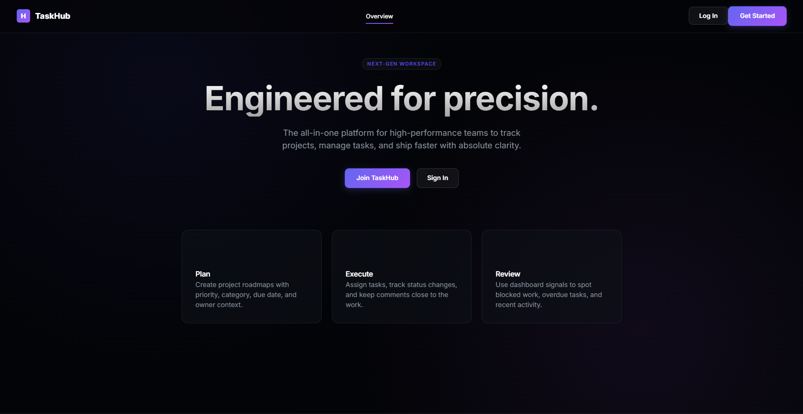
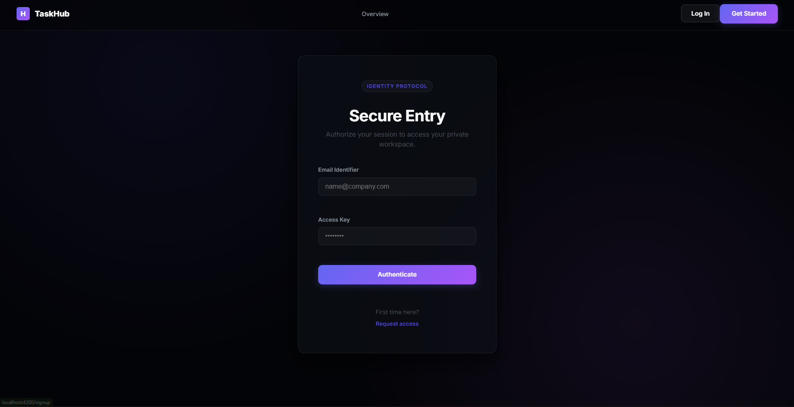
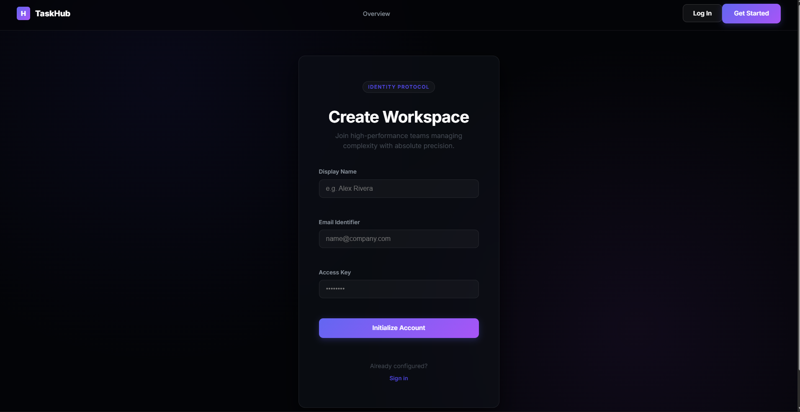
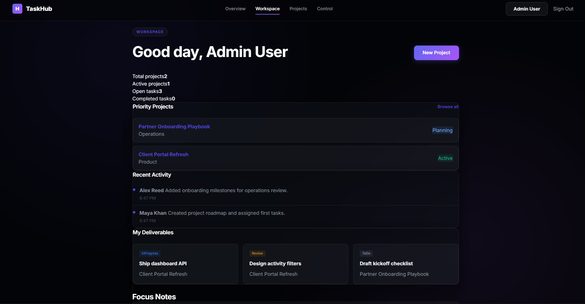
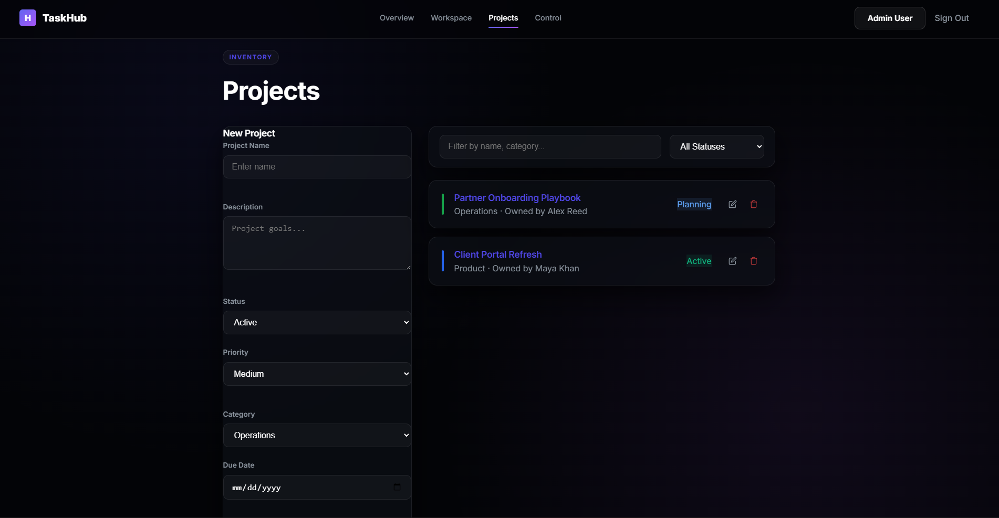
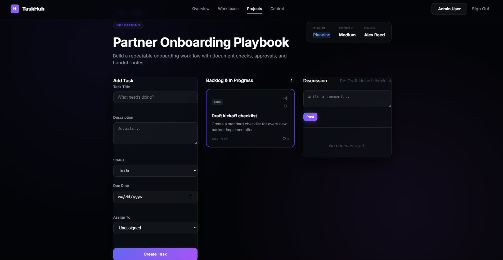

# Task Hub - Web Technologies Semester Project

Task Hub is a full-stack task and project management web application developed for the Web Technologies semester project. The system helps users create projects, manage tasks, organize categories, track progress, and collaborate through comments and dashboard statistics.

The project follows the required technology stack:

- **Frontend:** Angular, TypeScript, HTML, CSS
- **Backend:** ASP.NET Core Web API using C#
- **Database:** SQL-based database with seed/sample data

---

## Team Members

| Name | Registration No. |
| Hafiz Muhammad Ammar Ali | 2502123 |
| Saad Khalid | 2502137 |
| Marij Khan | 2502151 |

---

## Project Links

- **GitHub Repository:** https://github.com/hmaplays/FINAL-PROJECT-.git
- **Video Demo Link:** https://drive.google.com/file/d/1apnBJvWzzCa6xmafvo6o_HzkqcdX2Tur/view?usp=sharing
- **Project Report:** `/report/TaskHub_Lab_Report.pdf`

---

## Folder Structure

```text
Task-Hub-main/
│
├── frontend/        # Angular frontend application
│
├── backend/         # ASP.NET Core Web API backend
│
├── database/        # Database schema, seed data, and diagram
│
├── report/          # Project report PDF/DOCX
│
├── demo/            # Video demo link or demo notes
│
└── README.md        # Project documentation
```

## Main Features

- User registration and login system
- JWT-based authentication
- Dashboard with user-specific dynamic data
- Project creation, viewing, editing, and deletion
- Task management with CRUD operations
- Category management
- User/profile related pages
- Admin panel for managing users and data
- Comments/activity tracking for tasks
- Responsive user interface
- Data fetched from backend API using Angular HTTP Client
- Dynamic routing using Angular Router
- Reactive forms with validation
- Seed/sample data for demo testing

---

## Pages Included

| Page | Description |
|---|---|
| Home / Landing Page | Introductory page with attractive layout and project overview |
| Login / Signup | Authentication forms with validation |
| Dashboard | Displays user-specific dynamic records from the database |
| Projects Page | Allows users to manage projects |
| Tasks Page | Allows users to create, update, view, and delete tasks |
| Detail / Profile Page | Uses dynamic routing to show specific details |
| Admin Panel | Admin can manage users and application data |

---

## Technology Stack

### Frontend

- Angular
- TypeScript
- HTML
- CSS
- Angular Router
- Angular Services
- Angular Reactive Forms
- Angular HTTP Client

### Backend

- ASP.NET Core Web API
- C#
- RESTful API controllers
- JWT Authentication
- Entity Framework Core
- Proper HTTP status codes and error handling

### Database

- SQL-based relational database
- Minimum 5 related tables/entities
- Seed data included for demo
- Schema files available in `/database`

---

## Backend API Controllers

The backend contains multiple API controllers, including:

- `AuthController` - login, signup, and authentication
- `UsersController` - user management
- `ProjectsController` - project CRUD operations
- `TasksController` - task CRUD operations
- `CategoriesController` - category CRUD operations
- `CommentsController` - task/project comments
- `DashboardController` - dashboard statistics and summary data

---

## API Documentation

| Method | Endpoint | Description |
|---|---|---|
| POST | `/api/auth/register` | Register a new user |
| POST | `/api/auth/login` | Login user and generate token |
| GET | `/api/users` | Get all users |
| GET | `/api/projects` | Get all projects |
| POST | `/api/projects` | Create a new project |
| PUT | `/api/projects/{id}` | Update project details |
| DELETE | `/api/projects/{id}` | Delete a project |
| GET | `/api/tasks` | Get all tasks |
| POST | `/api/tasks` | Create a new task |
| PUT | `/api/tasks/{id}` | Update task details |
| DELETE | `/api/tasks/{id}` | Delete a task |
| GET | `/api/categories` | Get all categories |
| GET | `/api/dashboard` | Get dashboard summary data |

---

## Database Design

The database includes related entities such as:

- Users
- Projects
- Tasks
- Categories
- Comments
- Activity Logs

Database files are placed inside the `/database` folder:

```text
database/
├── schema.sql
├── seed.sql
└── schema-diagram.mmd
```

---

## Setup Instructions ( ALL PROJECT EXPLAINED )

### Prerequisites

Install the following tools before running the project:

- Node.js
- Angular CLI
- .NET SDK
- Visual Studio Code
- SQL Server / SQL database tool, depending on final database setup

---

## Running the Frontend

Open terminal in the `frontend` folder and run:

```bash
npm install
ng serve
```

Then open the frontend in browser:

```text
http://localhost:4200
```

---

## Running the Backend

Open terminal in the `backend` folder and run:

```bash
dotnet restore
dotnet build
dotnet run
```

The backend API will run on the URL shown in the terminal, commonly:

```text
https://localhost:5001
http://localhost:5000
```

or another local port shown by ASP.NET Core.

---

## Connecting Frontend with Backend

Make sure the API base URL in the Angular project is set correctly. Check the file:

```text
frontend/src/app/core/api.config.ts
```

Example:

```ts
export const API_BASE_URL = 'https://localhost:5001/api';
```

---

## Screenshots

### Home Page



### Login Page



### Signup Page



### Dashboard



### Projects Page



### Tasks Page



### Admin Panel


---

## JavaScript & DOM Demonstration

The project demonstrates dynamic UI behavior through:

- Event handling on forms and buttons
- Real-time UI updates without full page reload
- Dynamic content rendering through Angular components
- Form validation feedback
- User interaction on task/project CRUD operations

---

## Deployment

Deployment is optional, but the following platforms can be used:

### Frontend Deployment

- Vercel
- Netlify

### Backend Deployment

- Azure
- Railway
- Render

### Database Deployment

- Azure SQL

## Conclusion

Task Hub is a complete full-stack web application that demonstrates frontend development using Angular, backend API development using ASP.NET Core, and database integration using SQL-based storage. It fulfills the main Web Technologies semester project requirements by providing authentication, dynamic pages, CRUD operations, API communication, database-driven content, and a structured project report/demo plan.
